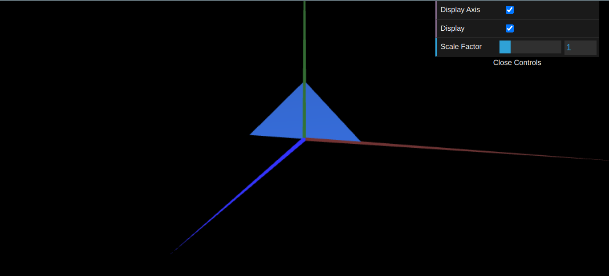
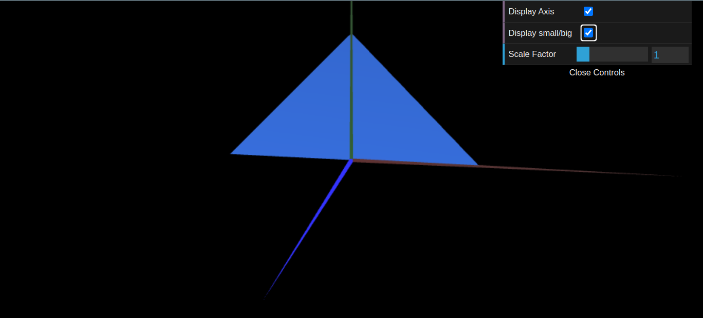

# CG 2023/2024

## Group T5G10

## TP 1 Notes

- In exercise 1, we learned how the structure and the library works and how different classes interact with each other using webCGF; 
- Main difficulty was to figure out how the image was drawn according to the order of the indices given (clockwise and counter-clockwise affects which side is visible according the plane the vertexes are situated);
- We also implemented a checkbox to toggle the visibility of the figure;
- In exercise 2 we repeated the process in exercise one but we added a toggle between the two triangles , making each of them visible according to the checkbox;

