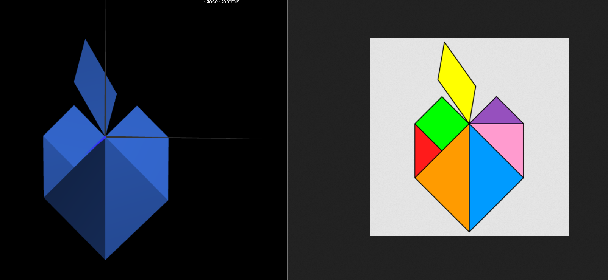
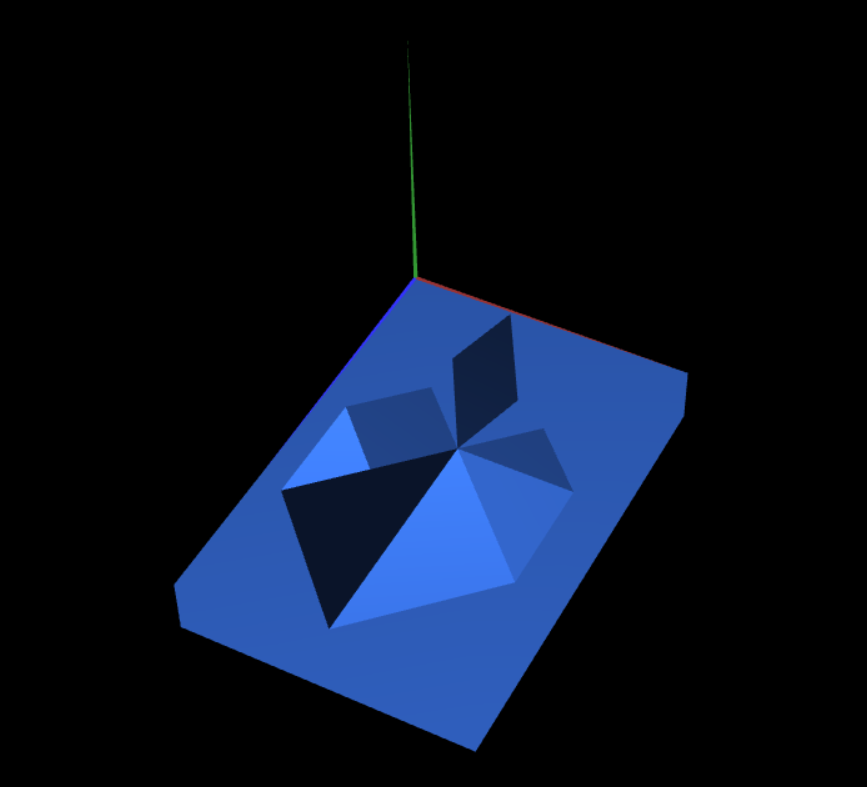
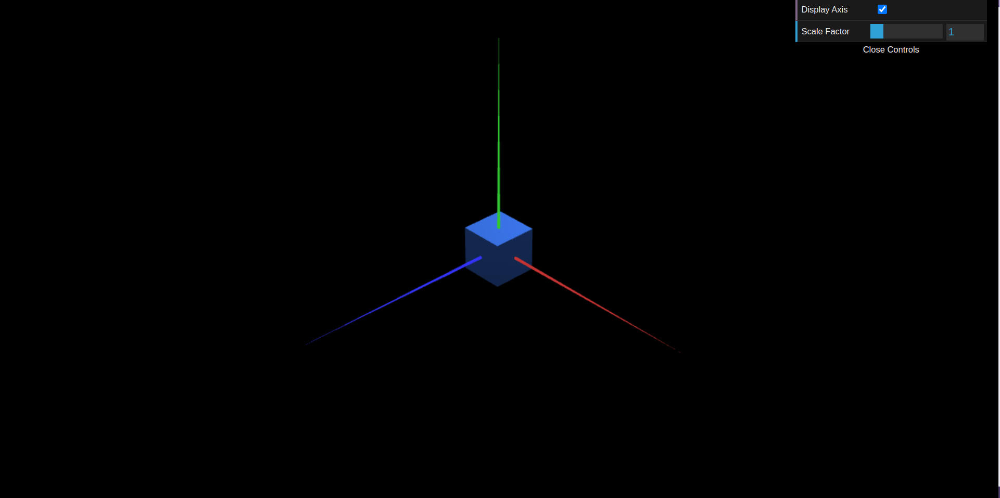

# CG 2023/2024

## Group T5G10

## TP 2 Notes

- In exercise 1, we used the geometric 2d shapes previously developed to make a tangram given to our group and applied the geometric transformations using two methods: using transformation matrices or transformation functions;
- In exercise 2, we made a cube out of triangles, by defining vertices of a cube and connecting different combinations of vertices to form small triangles in order to draw the cube;
- In the same exercise we also applied geometric transformation so the box would be a "base" for the tangram we have created;
- In exercise 3, we made the same cube as exercise 2 but this time, we created a new class called "MyQuad" which is a square created by 2 triangles centered in (0,0,0), and we used this new class as a side of the 6 sides of a cube.

