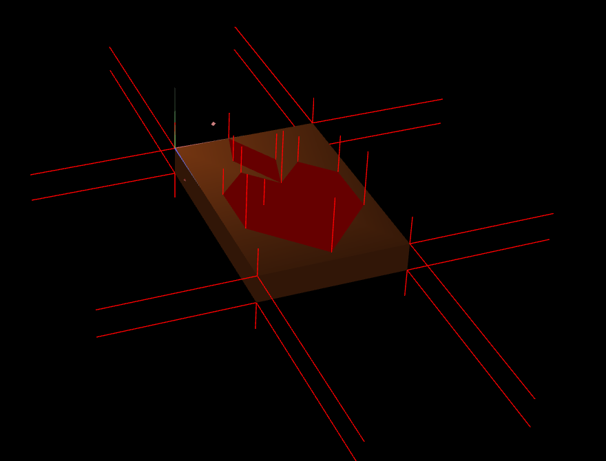
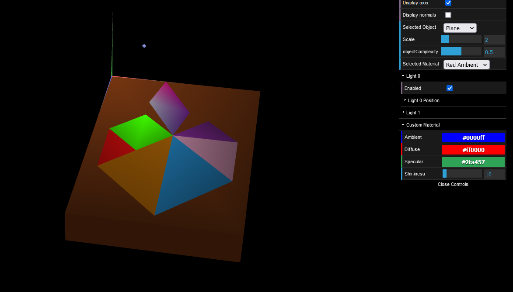
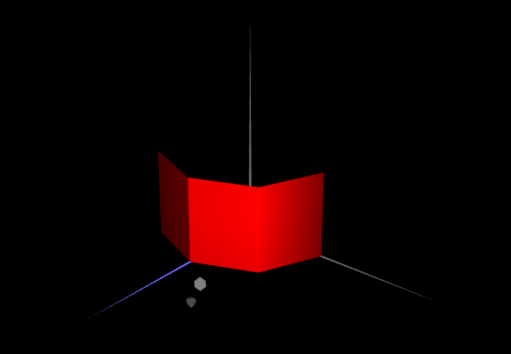
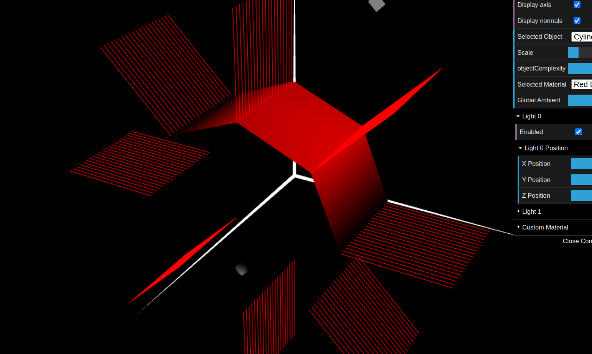

# CG 2023/2024

## Group T5G10

## TP 3 Notes

- In part 1, we created normal vectors for each of the vertices related to each of the faces of the shapes constructing the tangram, front and back, as each normal vector is associated with a vertex
- In part 2, we created a prism based on how many faces/slices and how many layers/stacks each prism would be constructed. We used the number of faces and stacks to make layers of vertices. The complicated part was to get the normal vectors for each vertex, which was obtained through cosine(x coordinate) and sine(y coordinate) of the half of a sections angle (180/number of faces), by adding and subtracting this value to obtain the two needed normal vectors associated with a duplicated vertex for each vertexes of the shape, looping through all vertices.
- In part 3, we made the same prism as part 2 but we modified the normal vectors to use only the cosine and sine of each sections angle and reduced the amount of vertices needed to make the prism as we only needed one vertex this time, calling it a cylinder. After changing the light settings to diffuse, we could observe the differences as the edges and faces are more smoothed out in the modified prism, looking more like a cylinder.

