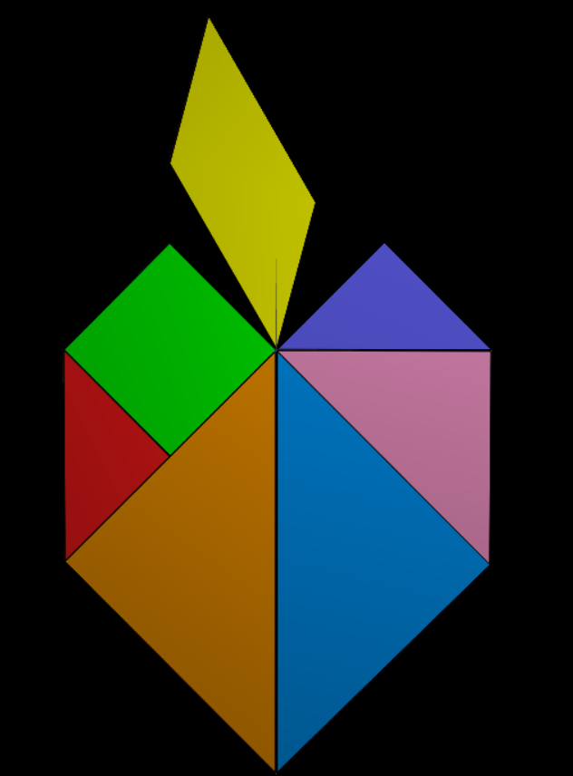
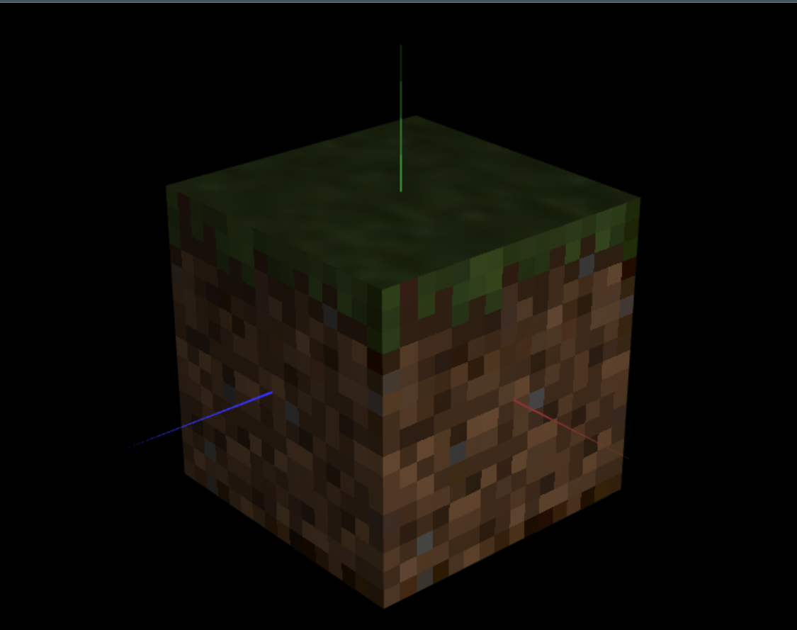

# CG 2023/2024

## Group T5G10

## TP 4 Notes

- In part 1, we continued working with our tangram shape. This time, we applied a texture to the different components instead of just setting their color through the lighting components of the materials. We had to use different texture coordinates for each component of the shape.
- In part 2, we used the unit cube made out of quads from previous TPs and we applied a different texture to each face of the cube in order to recreate the grass block. Due to the way the faces were oriented in our implementation of the unit cube, the side faces needed different texture coordinates in order to keep the small patch of grass in the correct orientation.

