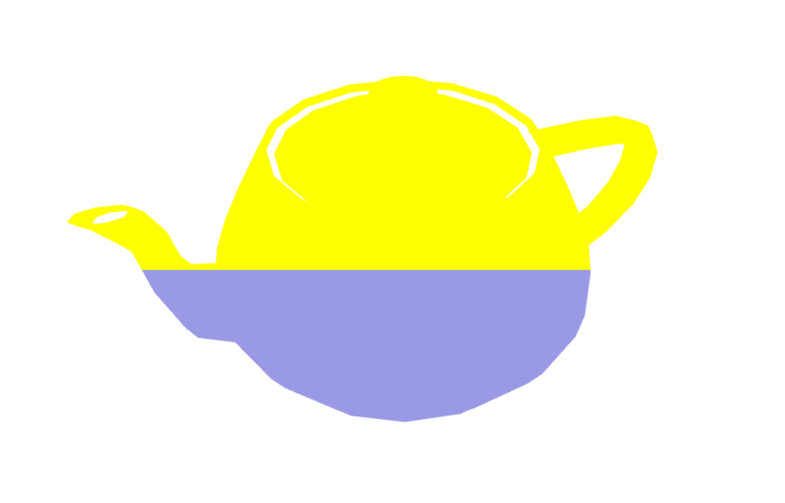
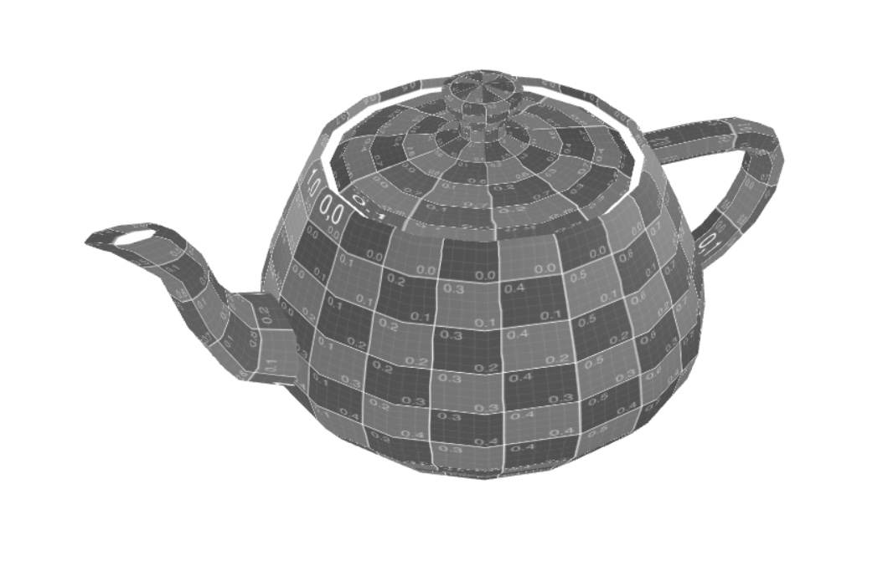

# CG 2023/2024

## Group T5G10

## TP 5 Notes

- In part 1, we used shaders to change the way a teapot was rendered. First, to apply a different color depending on the y coordinate of the pixel, we used a vertex shader in order to save the y coordinate in a variable. Said variable is then used in the fragment shader to color the pixel. Afterwards, based on the timeFactor variable present in the animation shader, we made the teapot move side to side based on a sine function. Secondly, to make the teapot grayscale, we made a new fragment shader, based on the existing sepia shader, with different weights on each component of the color in order to create the desired effect.
- In part 2, we created new shaders in order to make a simple plane look like flowing water. We had two textures, the water texture itself, and a map texture that we used to define how much each pixel of the plane should be raised. We achieved this by dynamically changing which part of the texture to apply to each pixel. We achieved this by applying an offset (calculated with the timeFactor) to the texture coordinates.

